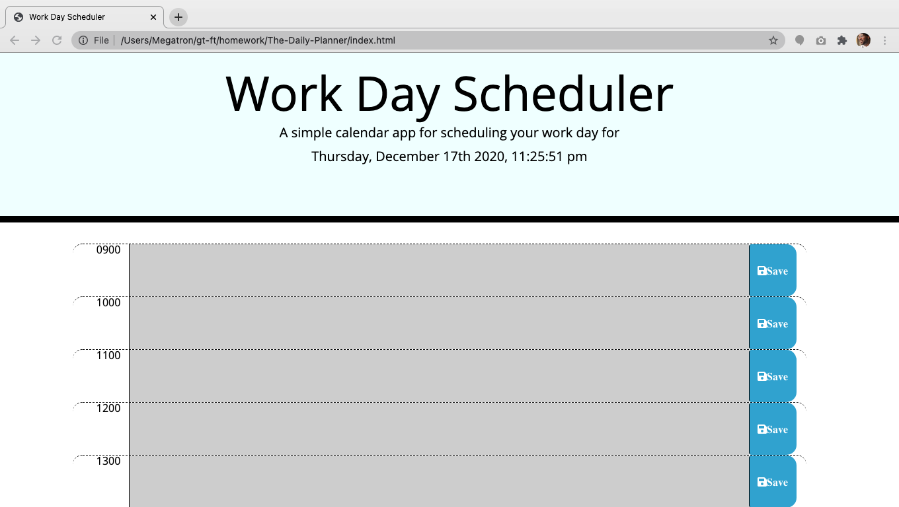
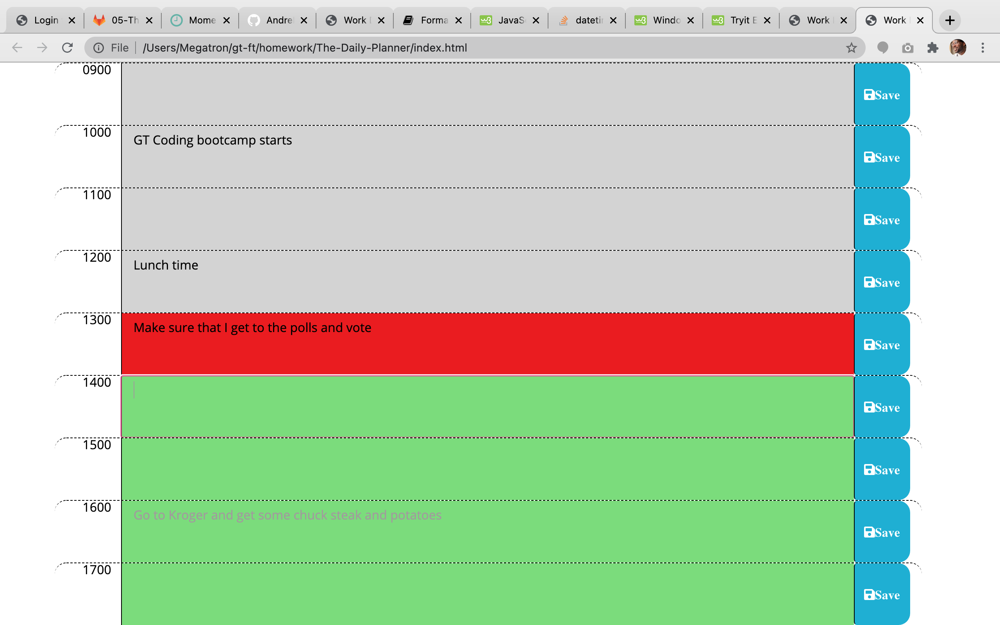

# The-Daily-Planner
This is a dynamic scheduling planner that will help organize your life


## Table of Contents

[About](https://github.com/AndreDiop/The-Daily-Planner/blob/main/README.md#About)

[Installation](https://github.com/AndreDiop/The-Daily-Planner/blob/main/README.md#Installation)

[Usage](https://github.com/AndreDiop/The-Daily-Planner/blob/main/README.md#Usage)

[Screenshots](https://github.com/AndreDiop/The-Daily-Planner/blob/main/README.md#Screenshots)

[Contributing](https://github.com/AndreDiop/The-Daily-Planner/blob/main/README.md#Contributing)

[Licenses](https://github.com/AndreDiop/The-Daily-Planner/blob/main/README.md#Licenses)
# About
Using jQuery, DOM manipulation and bootstrap elements, I was able to create a dynamic daily planner app that you can use to organize your life. Users are shown the rows of the planner with different colors corresponding to the time of day. Events in the past will be grey and future elements will be green and the present time of the row will be red. Psuedocoding help a lot with the development of the app and the execution of how to use time to set the row coloring.

## Access

Users will access the page through either the direct link to the deployed application

```bash
https://andrediop.github.io/The-Daily-Planner/
```

or through the Github repository

```bash
https://github.com/AndreDiop/The-Daily-Planner
```

## Usage
This app can be used by those looking to plan their work day out from the hours of 0900 - 1700.

## Screenshots

These screen shots show the planner in different states

```bash
Users are welcomed with this page
```



```bash
Users are presented with different colors for past, present and future states

```



## Contributing

This app could not have been built without the help of fellow students, instructors, tutors, and TA's of the GT coding bootcamp.

Please reach out to me if you see ways that I can improve upon my code and complete the functionality.


## License

[MIT](https://choosealicense.com/licenses/mit/)